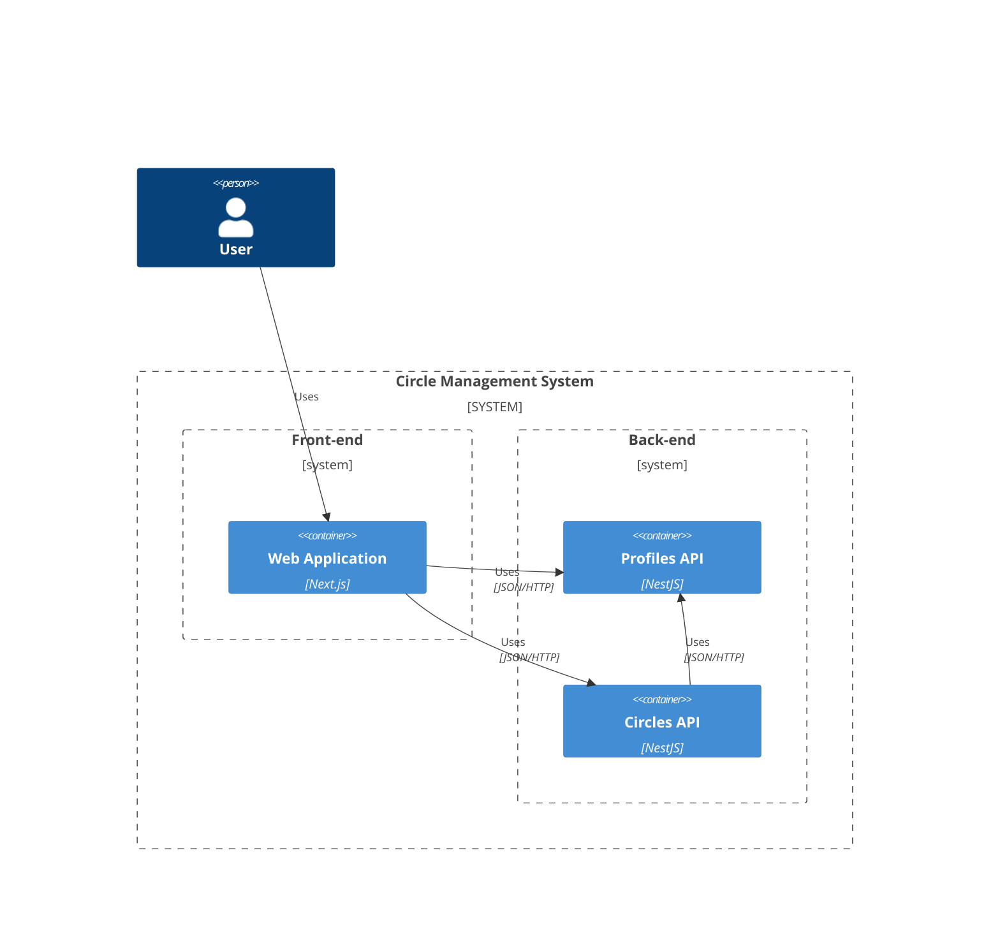

# Architecture

```mermaid
C4Container
  Person(user, "User")

  System_Boundary(container, "Circle Management System") {
    Boundary(frontend, "Front-end") {
      Container(web, "Web Application", "Next.js")

    }


    Boundary(backend, "Back-end") {
      Container(profiles, "Profiles API", "NestJS")


      Container(circles, "Circles API", "NestJS")
    }


    Rel(user, web, "Uses")

    Rel(circles, profiles, "Uses", "JSON/HTTP")

    Rel(web, profiles, "Uses", "JSON/HTTP")
    Rel(web, circles, "Uses", "JSON/HTTP")
  }
```
