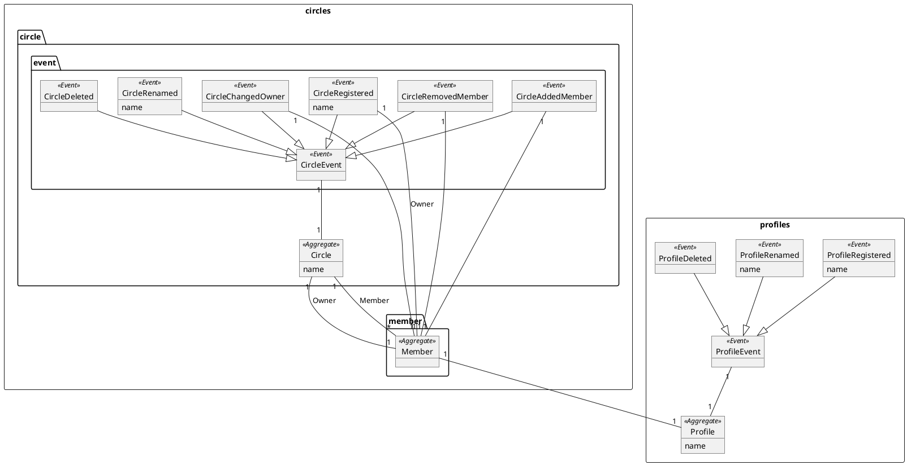

# Conceptual Models

```plantuml
@startuml


rectangle profiles {
  object ProfileEvent<<Event>>


  object ProfileRegistered<<Event>> {
    name
  }

  ProfileRegistered --|> ProfileEvent


  object ProfileRenamed<<Event>> {
    name
  }

  ProfileRenamed --|> ProfileEvent


  object ProfileDeleted<<Event>>

  ProfileDeleted --|> ProfileEvent


  object Profile<<Aggregate>> {
    name
  }

  Profile "1" -u- "1" ProfileEvent
}


rectangle circles {
  package member {
    object Member<<Aggregate>>

    Member "1" -- "1" Profile
  }


  package circle {
    package event {
      object CircleEvent<<Event>>


      object CircleRegistered<<Event>> {
        name
      }

      CircleRegistered --|> CircleEvent
      CircleRegistered "1" -- "1" Member : Owner


      object CircleRenamed<<Event>> {
        name
      }

      CircleRenamed --|> CircleEvent


      object CircleDeleted<<Event>>

      CircleDeleted --|> CircleEvent


      object CircleChangedOwner<<Event>>

      CircleChangedOwner --|> CircleEvent
      CircleChangedOwner "1" -- "1" Member


      object CircleAddedMember<<Event>>

      CircleAddedMember --|> CircleEvent
      CircleAddedMember "1" -- "1" Member


      object CircleRemovedMember<<Event>>

      CircleRemovedMember "1" -- "1" Member
      CircleRemovedMember --|> CircleEvent
    }


    object Circle<<Aggregate>> {
      name
    }

    Circle "1" -u- "1" CircleEvent
    Circle "1" -- "1" Member : Owner
    Circle "1" -- "*" Member : Member
  }
}


@enduml
```
