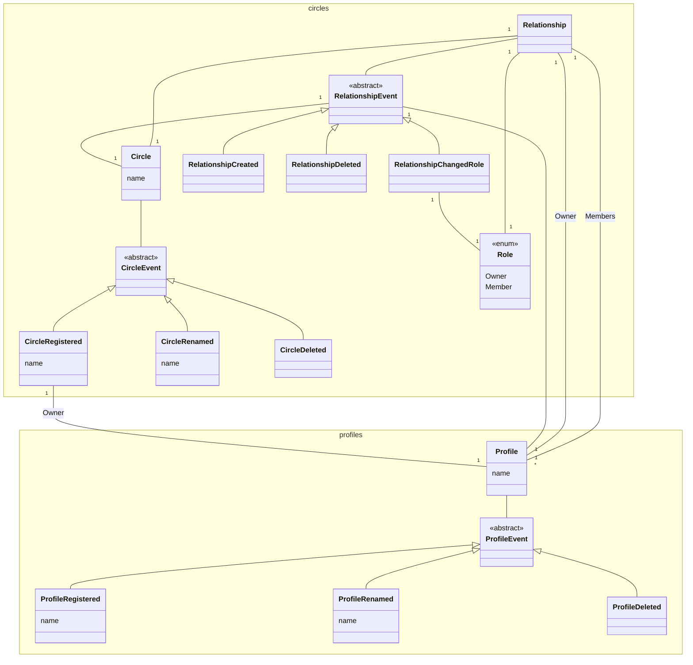

# Conceptual Models

```mermaid
classDiagram
  namespace profiles {
    class ProfileEvent {
      <<abstract>>
    }


    class ProfileRegistered {
      name
    }


    class ProfileRenamed {
      name
    }


    class ProfileDeleted


    class Profile {
      name
    }
  }

  Profile -- ProfileEvent

  ProfileEvent <|-- ProfileRegistered
  ProfileEvent <|-- ProfileRenamed
  ProfileEvent <|-- ProfileDeleted


  namespace circles {
    class CircleEvent {
      <<abstract>>
    }


    class CircleRegistered {
      name
    }


    class CircleRenamed {
      name
    }


    class CircleDeleted


    class Circle {
      name
    }


    class RelationshipEvent {
      <<abstract>>
    }


    class RelationshipCreated


    class RelationshipDeleted


    class RelationshipChangedRole


    class Role {
      <<enum>>
      Owner
      Member
    }


    class Relationship
  }

  Circle -- CircleEvent

  CircleEvent <|-- CircleRegistered
  CircleEvent <|-- CircleRenamed
  CircleEvent <|-- CircleDeleted

  CircleRegistered "1" -- "1" Profile : Owner

  RelationshipEvent "1" -- "1" Circle
  RelationshipEvent "1" -- "1" Profile

  RelationshipEvent <|-- RelationshipCreated
  RelationshipEvent <|-- RelationshipDeleted
  RelationshipEvent <|-- RelationshipChangedRole

  RelationshipChangedRole "1" -- "1" Role

  Relationship "1" -- "1" Role
  Relationship -- RelationshipEvent
  Relationship "1" -- "1" Circle
  Relationship "1" -- "1" Profile : Owner
  Relationship "1" -- "*" Profile : Members
```
