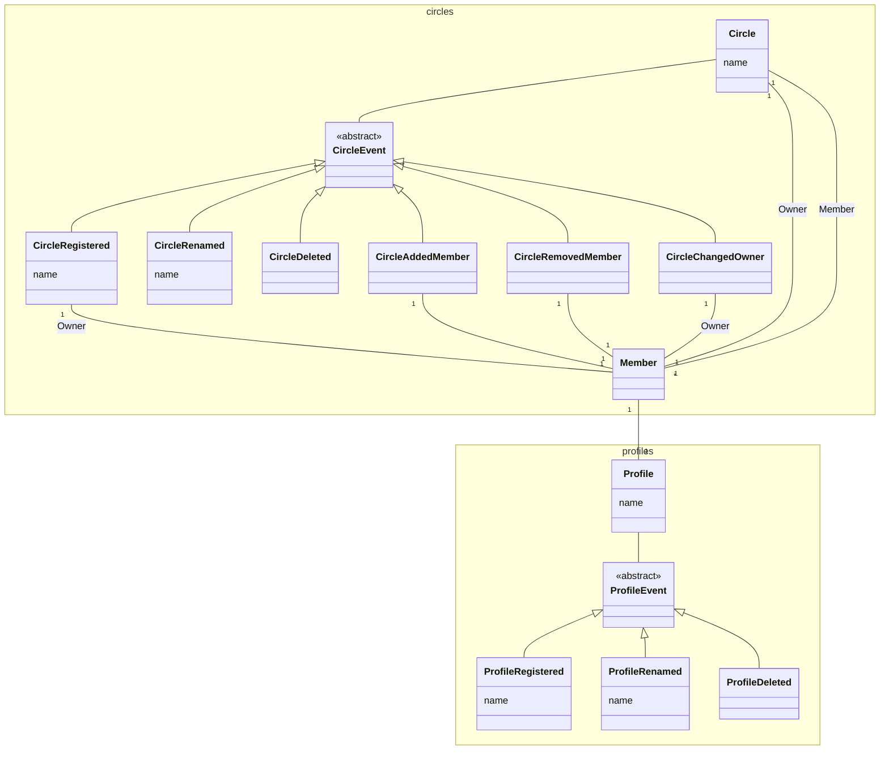

# Conceptual Models

```mermaid
classDiagram
  namespace profiles {
    class ProfileEvent {
      <<abstract>>
    }


    class ProfileRegistered {
      name
    }


    class ProfileRenamed {
      name
    }


    class ProfileDeleted


    class Profile {
      name
    }
  }

   Profile -- ProfileEvent

   ProfileEvent <|-- ProfileRegistered
   ProfileEvent <|-- ProfileRenamed
   ProfileEvent <|-- ProfileDeleted


  namespace circles {
    class Member


    class CircleEvent {
      <<abstract>>
    }


    class CircleRegistered {
      name
    }


    class CircleRenamed {
      name
    }


    class CircleDeleted


    class CircleAddedMember


    class CircleRemovedMember


    class CircleChangedOwner


    class Circle {
      name
    }
  }

  Member "1" -- "1" Profile

  Circle -- CircleEvent
  Circle "1" -- "1" Member : Owner
  Circle "1" -- "*" Member : Member

  CircleEvent <|-- CircleRegistered
  CircleEvent <|-- CircleRenamed
  CircleEvent <|-- CircleDeleted
  CircleEvent <|-- CircleAddedMember
  CircleEvent <|-- CircleRemovedMember
  CircleEvent <|-- CircleChangedOwner

  CircleRegistered "1" -- "1" Member : Owner
  CircleAddedMember "1" -- "1" Member
  CircleRemovedMember "1" -- "1" Member
  CircleChangedOwner "1" -- "1" Member : Owner
```
