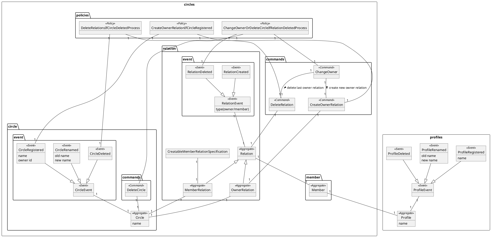

# Conceptual Models

```plantuml
@startuml


rectangle profiles {
  object ProfileEvent<<Event>>


  object ProfileRegistered<<Event>> {
    name
  }

  ProfileRegistered --|> ProfileEvent


  object ProfileRenamed<<Event>> {
    old name
    new name
  }

  ProfileRenamed --|> ProfileEvent


  object ProfileDeleted<<Event>>

  ProfileDeleted --|> ProfileEvent


  object Profile<<Aggregate>> {
    name
  }

  Profile "1" -u- "1" ProfileEvent
}


rectangle circles {
  package circle {
    package event {
      object CircleEvent<<Event>>


      object CircleRegistered<<Event>> {
        name
        owner id
      }

      CircleRegistered --|> CircleEvent


      object CircleRenamed<<Event>> {
        old name
        new name
      }

      CircleRenamed --|> CircleEvent


      object CircleDeleted<<Event>>

      CircleDeleted --|> CircleEvent
    }


    object Circle<<Aggregate>> {
      name
    }

    Circle "1" -u- "1" CircleEvent


    package commands {
      object DeleteCircle<<Command>>

      DeleteCircle "1" -- "1" Circle
    }
  }


  package member {
    object Member<<Aggregate>>

    Member "1" -- "1" Profile
  }


  package relation {
    package event {
      object RelationEvent<<Event>> {
        type(owner/member)
      }

      'RelationEvent "1" -- "1" Circle
      'RelationEvent "1" -- "1" Member


      object RelationCreated<<Event>>

      RelationCreated --|> RelationEvent


      object RelationDeleted<<Event>>

      RelationDeleted --|> RelationEvent
    }

    object Relation<<Aggregate>> {
    }

    Relation "1" -u- "1" RelationEvent
    Relation "1" -- "1" Member


    object OwnerRelation<<Aggregate>>

    OwnerRelation -u-|> Relation
    OwnerRelation "1" -- "1" Circle

    object MemberRelation<<Aggregate>>

    MemberRelation -u-|> Relation
    MemberRelation "*" -- "1" Circle


    object CreatableMemberRelationSpecification

    CreatableMemberRelationSpecification "1" -- "1" MemberRelation
  }


  package commands {
    object CreateOwnerRelation<<Command>>

    CreateOwnerRelation "1" -- "1" OwnerRelation


    object DeleteRelation<<Command>>

    DeleteRelation "1" -- "1" Relation


    object ChangeOwner<<Command>>

    ChangeOwner "1" -- "1" CreateOwnerRelation : create new owner relation >
    ChangeOwner "1" -- "1" DeleteRelation : delete last owner relation >
  }


  package policies {
    object DeleteRelationsIfCircleDeletedProcess<<Policy>>

    DeleteRelationsIfCircleDeletedProcess "1" -- "1" CircleDeleted
    DeleteRelationsIfCircleDeletedProcess "1" -- "1" DeleteRelation


    object ChangeOwnerOrDeleteCircleIfRelationDeletedProcess<<Policy>>

    ChangeOwnerOrDeleteCircleIfRelationDeletedProcess "1" -- "1" ChangeOwner
    ChangeOwnerOrDeleteCircleIfRelationDeletedProcess "1" -- "1" DeleteCircle
    ChangeOwnerOrDeleteCircleIfRelationDeletedProcess "1" -- "1" RelationDeleted


    object CreateOwnerRelationIfCircleRegistered<<Policy>>

    CreateOwnerRelationIfCircleRegistered "1" -- "1" CreateOwnerRelation
    CreateOwnerRelationIfCircleRegistered "1" -- "1" CircleRegistered
  }
}


@enduml
```
