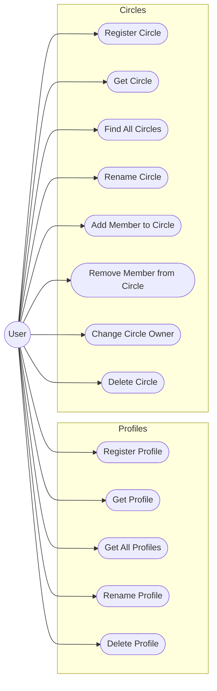

# Use Cases

```mermaid
graph LR
  User((User))

  subgraph "Profiles"
    RegisterProfile([Register Profile])
    GetProfile([Get Profile])
    GetAllProfiles([Get All Profiles])
    RenameProfile([Rename Profile])
    DeleteProfile([Delete Profile])
  end

  User --> RegisterProfile
  User --> GetProfile
  User --> GetAllProfiles
  User --> RenameProfile
  User --> DeleteProfile


  subgraph "Circles"
    RegisterCircle([Register Circle])
    GetCircle([Get Circle])
    FindAllCircles([Find All Circles])
    RenameCircle([Rename Circle])
    AddMemberToCircle([Add Member to Circle])
    RemoveMemberFromCircle([Remove Member from Circle])
    ChangeCircleOwner([Change Circle Owner])
    DeleteCircle([Delete Circle])
  end


  User --> RegisterCircle
  User --> GetCircle
  User --> FindAllCircles
  User --> RenameCircle
  User --> AddMemberToCircle
  User --> RemoveMemberFromCircle
  User --> ChangeCircleOwner
  User --> DeleteCircle
```
