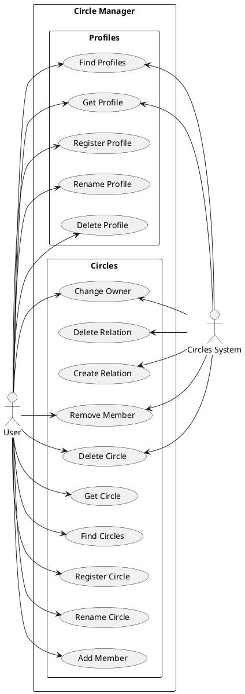

# Use Cases

```plantuml
@startuml

left to right direction


actor User

actor "Circles System" as circles


rectangle "Circle Manager" {
  rectangle Profiles {
    usecase "Get Profile" as getProfile
    usecase "Find Profiles" as findProfiles
    usecase "Register Profile" as registerProfile
    usecase "Rename Profile" as renameProfile
    usecase "Delete Profile" as deleteProfile

    User --> getProfile
    User --> findProfiles
    User --> registerProfile
    User --> renameProfile
    User --> deleteProfile

    circles -u-> getProfile
    circles -u-> findProfiles
  }

  rectangle Circles {
    usecase "Get Circle" as getCircle
    usecase "Find Circles" as findCircles
    usecase "Register Circle" as registerCircle
    usecase "Rename Circle" as renameCircle
    usecase "Delete Circle" as deleteCircle

    usecase "Add Member" as addMember
    usecase "Remove Member" as removeMember
    usecase "Create Relation" as createRelation
    usecase "Delete Relation" as deleteRelation
    usecase "Change Owner" as changeOwner

    User --> getCircle
    User --> findCircles
    User --> registerCircle
    User --> renameCircle
    User --> deleteCircle
    User --> addMember
    User --> removeMember
    User --> changeOwner

    circles -u-> deleteCircle
    circles -u-> removeMember
    circles -u-> createRelation
    circles -u-> deleteRelation
    circles -u-> changeOwner
  }
}

@enduml
```
